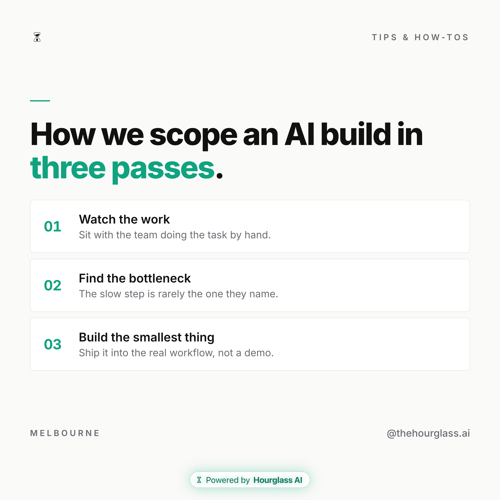
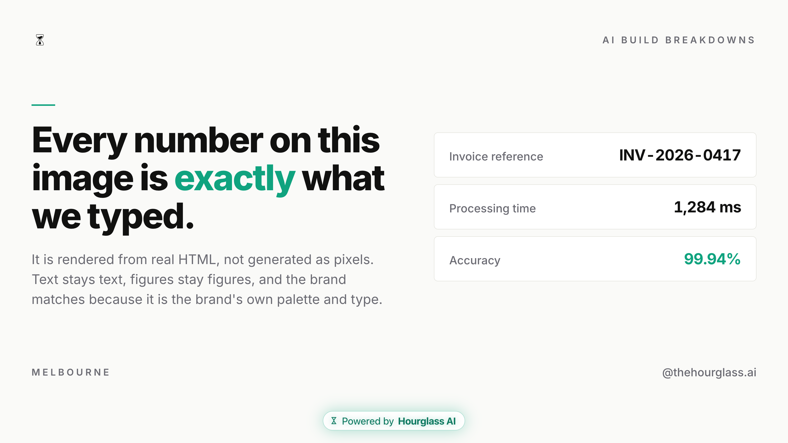

# Brand Studio (Claude Code plugin)

Learn a brand from its own assets once, then generate new on-brand graphics from a
prompt forever. Drop in a brand's examples, logo and fonts; the plugin analyses them
into a saved **brand kit**, and every graphic after that comes out in that style. Each
image is rendered from real HTML/CSS, so the brand match is exact and the text and
numbers are never garbled (the thing image generators get wrong).

```
/create-brand                                       → learn a brand from its assets
/collect-inspo                                      → teach the brand its taste from references it admires
/create-asset                                       → on-brand PNG, at any social shape
/edit-brand                                         → change a saved brand's palette/font/voice/...
```

## What it makes

All three of these came out of one brand kit, from a one-line prompt each. Same palette,
same type, same house style; different canvas, different content. Nothing was placed by
hand and nothing was touched afterwards.

| Instagram / LinkedIn portrait | LinkedIn square |
|---|---|
|  |  |



That last one is the point of the whole thing: the invoice reference, the timing and the
percentage are real text in a real layout, so they render exactly as written. An image
model would garble them.

## How it works

```
assets ──▶ /create-brand   analyse look + voice → a saved brand kit (brand.json + assets + examples)
prompt ──▶ /create-asset   write the copy in the brand's voice, author the visual in the
                           brand's house style, render real HTML/CSS → pixel-perfect PNG (+ PDF)
```

Three ideas make it work:

- **The brand is data, not code.** A kit is a `brand.json` (role-mapped palette, fonts,
  logo, voice, and a *house-style spec*) plus its asset and example files. No per-brand
  layout code: the look is described, and each asset is drawn fresh to fit it.
- **Taste is its own layer.** `/collect-inspo` ingests references the brand *admires*
  (a Notion swipe file, a folder of screenshots, named accounts) and distils them once into
  archetypes, visual grammar and dos/don'ts saved as `inspiration.json`. Generation picks
  the closest-fit archetype and applies the grammar, so the output looks like *them at their
  best*, not the average of every example pulled in at run time.
- **A shape is just a canvas.** `ig-square`, `ig-story`, `youtube` (16:9) and friends carry
  no content. The brand kit and the prompt decide what gets drawn; the shape only sets the
  size. So the same idea can be composed for any platform without distortion.

## Install

**Option A. Already have [Claude Code](https://code.claude.com/docs/en/setup)?** Two commands:

```bash
claude plugin marketplace add HourglassDigital/brand-studio
claude plugin install brand-studio@hourglass
```

Then **start a new Claude Code session** (plugins load when a session starts) and type `/` —
you'll see `/create-brand`, `/collect-inspo`, `/create-asset`, `/edit-brand`.

**Option B. Starting from scratch?** Open Terminal and paste this:

```bash
curl -fsSL https://raw.githubusercontent.com/HourglassDigital/brand-studio/main/install.sh | bash
```

It checks what you need, installs Claude Code and the plugin, and tells you the two things
to type.

Either way, start with `/create-brand`: it walks you through teaching it a brand and hands
you on to the rest when it's done. Have 2-3 screenshots of posts you like the look of ready:
that's the only input that really matters.

<details>
<summary>Check it worked</summary>

```bash
claude plugin list        # brand-studio@hourglass → enabled, no errors
```
</details>

<details>
<summary>Requirements & notes</summary>

- **A paid Claude plan** (Pro or Max). Claude Code isn't on the free tier.
- **Node.js + npm** — the installer checks for it, and installs it via Homebrew if it can.
  On first run a `SessionStart` hook quietly installs the one engine dependency
  (`playwright-core`). Takes a few seconds, once.
- **Google Chrome or Chromium** — to render with. The engine auto-detects Google Chrome or a
  cached Playwright Chromium. If you have neither: `npx playwright install chromium`.
- **Access** — this repo is public, so the two commands above work for anyone. No GitHub
  account or org membership needed.
- You start with a **clean slate** (no brands) — add yours with `/create-brand`.

**Try it locally without installing** (for developing the plugin):
```bash
claude --plugin-dir /path/to/brand-studio
```

**Update** to the latest after changes are pushed:
```bash
claude plugin update brand-studio@hourglass
```
</details>

## Skills

| Skill | What it does |
|---|---|
| `/create-brand` | Learn a brand from 1-3 example graphics + logo + fonts; saves a brand kit (palette, fonts, logo, voice, house-style spec). Walks you through it with questions. |
| `/collect-inspo` | Teach a saved brand its *taste* by feeding in references it admires (URLs, screenshots, a Notion swipe file, named accounts). Distils them into archetypes + visual grammar + dos/don'ts and saves it as `inspiration.json`. Re-run to add more, additively. |
| `/create-asset <topic>` | Write on-brand copy + author the visual in the brand's house style, structured around the closest-fit inspiration archetype + render the PNG, at a chosen/inferred shape. Runs an edit loop and can save your preferences. (Add "as a PDF" for an editable Canva import.) |
| `/edit-brand` | Deliberately change a saved brand's kit (palette, fonts, logo, voice, house-style, handle/CTA), then re-render a test so you see the effect. |

## Shapes

Standard canvases, inferred from the prompt's platform unless you specify one:

| Shape | Platform | Size |
|---|---|---|
| `ig-square` | Instagram post | 1080×1080 |
| `ig-portrait` | Instagram / LinkedIn portrait | 1080×1350 |
| `ig-story` | Instagram / Reels story | 1080×1920 |
| `linkedin` | LinkedIn post | 1200×1200 |
| `x` | X / Twitter | 1600×900 |
| `youtube` | YouTube thumbnail / cover | 1920×1080 |

## Where your brands live

Saved in the plugin's persistent data dir (`${CLAUDE_PLUGIN_DATA}`, falling back to
`~/.brand-studio`), so they survive restarts and plugin updates. Each kit is
`brands/<slug>/` with `brand.json` (the immutable analysed base), an optional
`preferences.json` (learned tweaks that overlay the base), an optional `inspiration.json`
(distilled taste signals + a folder of saved references), `assets/` and `examples/`.
Nothing brand-specific lives in the plugin code.

## Engine (run directly, optional)

```bash
ENGINE=engine
node $ENGINE/brandctl.mjs list
node $ENGINE/brandctl.mjs shapes
node $ENGINE/brandctl.mjs use <slug>
echo '{"css":"...","body":"..."}' | \
  node $ENGINE/cli.mjs --brand <slug> --shape ig-square --data - --out out.png --pdf
npm --prefix $ENGINE test          # smoke tests (shapes, base⊕preferences merge, render)
```

The engine is deliberately thin. It takes a brand kit + a shape + an asset's
`{ css, body }` (authored by `/create-asset`), injects the brand's fonts, palette CSS variables
(`--bg --ink --accent ...`) and logo (`{{logo}}` placeholder), sizes the canvas to the
shape, and screenshots it to PNG/PDF. It imposes no look of its own, with one deliberate
exception: every render carries a small "Powered by Hourglass AI" mark at the bottom.

## Ships with

- Six standard social shapes (above) and a thin, brand-neutral render engine.
- **A clean slate** — no brands preloaded; every install starts empty and private to that
  machine. Add yours with `/create-brand`.
